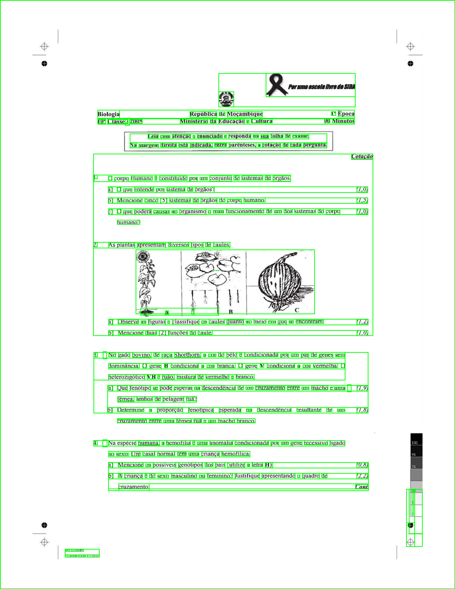
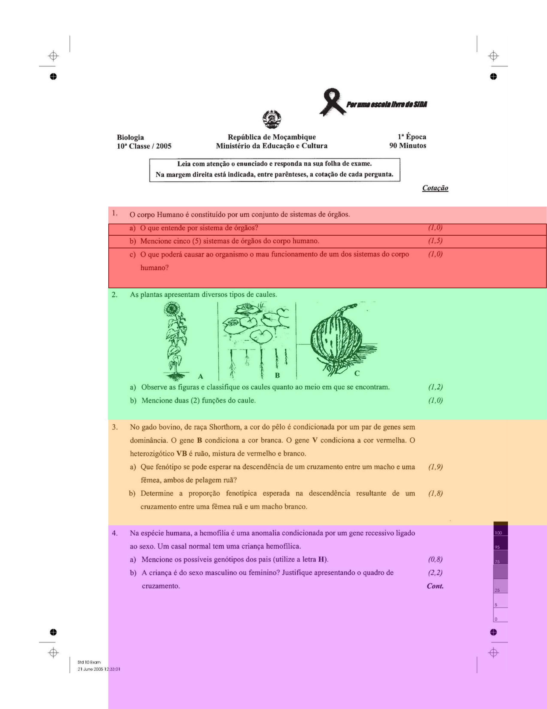

# mozexames-ml

Exams data extractor w/ Machine Learning.

## Getting started

This app is using vanilla `Python 3.10`, leveraging VS Code's `Dev Containers (a.k.a Remote Containers) + Docker Compose` for its environment.
For Machine Learning, this project uses the best pre-trained Portuguese Text Recognition model from [`tesseract-ocr`](https://github.com/tesseract-ocr/tesseract), enabled by the [`pytesseract`](https://pypi.org/project/pytesseract/) Python wrapper.

### System requirements
- Docker `version >= 23.0` (Recommended to use the latest version if possible)
- VS Code
- That's it!

### First time

1. Clone the project, `cp .env.example .env` then open it on your `VS Code`.
2. Install the `ms-vscode-remote.remote-containers` VS Code extension (if not already).
3. Open the Command Pallete <kbd>CMD / CTRL</kbd> + <kbd>P</kbd> then search and run `Dev Container: Reopen in Container`.
> This will start building the `Dev Container` using `docker-compose.yml`.
>
> - Once it's built, use the terminal within VS Code to execute other commands using `./run`.
>
> - Ensure that VS Code has selected the correct Python interpreter within your new environment: `/usr/local/bin/python`.
4. Use `./run app` to execute the main `src/app.py` script at anytime.

> **Note**
>
> Use `./run test` run tests.
>
> > You can also append `-k [name]` to run tests matching the provided name in isolation
>
> Hint: The `./run app` command essential does `./run python src/app.py`

> **Warning**
>
> It is recommended to develop within a `Dev Container` as you'll be able to use
> the Python interpreter installed within your container, and correct IDE dependency suggestions and links via the pre-installed `pylance` extension.
>
> ---
>
> As a side-note, you can manually build your the docker container using `./run build` if you don't fancy using `Dev Containers`, and use the same `./run` commands as you would, with the only difference being that your IDE will struggle to find the installed dependencies.

## Development

- `./run test` to run tests.
- `./run python`: Execute `python` commands
- `./run pip`: Execute `pip` commands (`./run pip install ...` is disabled, and you should use `./run pip:install` instead)
  - To add a new dependency, add the name to `requirements.in`, then `./run pip:install` to install and automatically sync `requirements.txt`. Avoid `pip install [name]`. This project uses [`pip-tools`](https://github.com/jazzband/pip-tools) to manage its dependencies.
- `./run bash` to enter `bash` within the container when outside of the `Dev Container` environment.

## About

The goal of this project is to automate the process of extracting questions and answer options from any Mozambican exam paper.

| Full OCR Sample (using [`tesseract-ocr`](https://github.com/tesseract-ocr/tesseract) and the `best` `Portuguese` pre-trained model) | Current extraction approach sample |
| --- | --- |
|  | |

## Credits

This stack is adapted from:

- https://github.com/nickjj/docker-django-example
